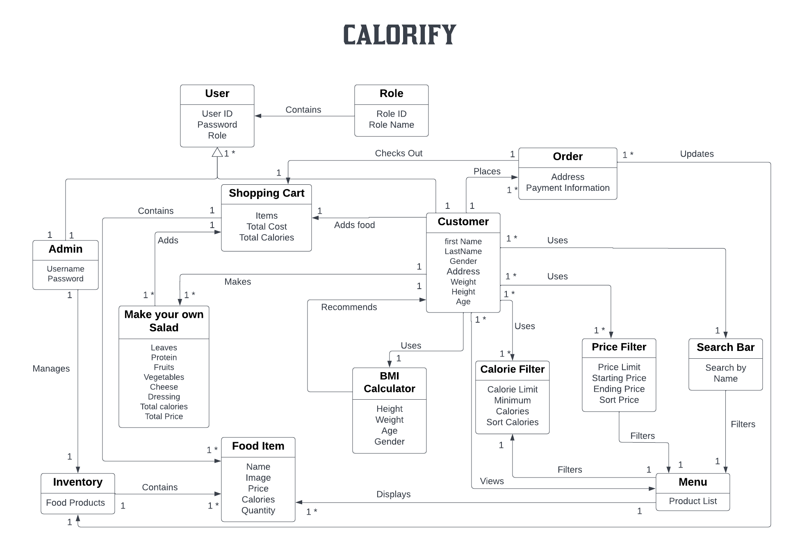

# E-Store: Calorify - Online Food Store

An online E-store system built in Java 8=>11 and Spring Tools 4.16

## Executive Summary

Calorify is an e-commerce store which is dedicated to allowing the customers to choose and purchase healthy food products in order to cater to their calorie intake requirements. We want to provide a platform on which customers can, easily and safely, browse and purchase various healthy food products including salads, wraps, dips and our signature dishes. It is completely user-input based so that we can meet the needs of our customer and help them acheive their diet goals.

## Purpose

Our purpose is to allow our customers to purchase high quality healthy food products to satisfy their daily calorie requirements with a considerable amount of freedom towards customization. The inventory manager or the owner of the store, their functionality includes that they can view, add, update, and delete products from the menu listing.

## Application Domain

There is a parent entity which represents the user, is then extended into two based on privileges of the role: 1) admin/owner 2) customer. Another crucial entity is the product/food that is being sold for purchase by a customer. The products being sold are kept inside inventory. The admin is able to modify the contents of this inventory. A customer has access to the menu which displays all the products present in the inventory. The admin is the only one allowed to add, remove, and update products in the inventory. The customer can also search for products by name, price, and calories. If the customer wants to filter for a specific product or type of product, they use the Search bar. They can also use search filters to specify and narrow down the price or calories they want to intake. They can also sort the menu by price or calories.

The customer can add products from inventory to their shopping cart, which can be described as an attribute of User and the shopping cart is persistent across login sessions. The customer can checkout from shopping cart to place an order. For checking out, the customer has to enter an address and card details. The items are then subtracted from inventory. The customer can use ingredients in the inventory to make their own salad which will be a custom product created by the user that will be placed in the shopping cart and can be purchased in checkout. Finally the customers personal details can be usd to calculate BMI and the recommended calories. This can be used by the user to filter products based their suggested calorie intake.

## Architecture and Design

- The Estore-UI is the graphical user interface front end for our application. It is made up of HTML, CSS, and TypeScript code and uses the Angular framework. The Estore-UI communicates with the Estore-API to fetch data and to send data back to the backend for processing.

- The Estore-API is the back end for our application. It is made up of Java code and uses the Spring framework. The Estore-API receives HTTP requests from the Estore-UI and responds with HTTP answers. The Estore-API uses I/O to communicate with the storage for read and write. JSON files constitute the storage and format of requests and response bodies

- Our application consists of three main components: the model, the controller and the persistence.

### Definition of MVP

The minimum viable product includes:

- Login and logout functionality, where an inventory manager can log in as "admin" and no passwords are required

- Customer functionality, including searching for products, adding products to their shopping cart, and checking out Inventory management, which allows inventory managers to add, remove, and update products in the inventory Data persistence, so that the inventory, users, and user shopping carts are saved.

- 10% feature - An additional feature implemented on top of the MVP.

### MVP Features

#### Epics

- Product Lists
  - List Products on Customer Product Page
  - Product Details

- Inventory Management
  -Add to Inventory
  -List Inventory
  -Delete from Inventory
  -Edit inventory item

- Shopping Cart
  -Display Cart
  -Add to Cart
  -Remove from Cart
  -Change Quantity
  -Confirm Cart
  -Cart Persistence

- Login
  -Logout
  -Login as User
  -Login as E-Store Admin

- Product API
  -Create New Product
  -Get a single product
  -Get Entire Inventory
  -Search Product
  -Update Product
  -Delete a Single Product

- User API
  -Create a New User
  -Get a single User
  -Update User
  -Delete User
  -Get All Users

- Registration Page
  -Entering and Creating User
  -Enter Personal Details

- User Profile
  -View User Profile
  -Edit User Profile

- Role API
  -Create a New Role
  -Get All Roles
  -Delete Role

- Spring Security
  -Login API
  -Admin Registration Roles
  -User Registration Roles
  -Unregistered User Roles

- Product Search Component
  -Search Food Items by Name
  -Search Food Items by Price
  -Search Food Items by Caloric Range

- Sorting and Filters
  -Sort by Calories
  -Sort by Price

- Customer Checkout
  -Checkout from Shopping Cart
  -List Shopping Cart Contents on Checkout Page
  -Purchase Options
  -Direct Checkout from Product Details

- Make Your Own Salad
  -Add Ingredients
  -Remove Ingredients
  -Calorie Adder

## Roadmap of Enhancements

### Sprint 1

For the first sprint, we focused on getting the backend functional for the MVP. We worked on the backend for inventory management and product listing. It mainly consisted of working on the Product model, CRUD operations in the Controller and FileDAO and setting up the API endpoints. The end goal was to have a functioning backend for the MVP that was able to store and retrieve product data
The User Stories and Enhancements we worked on are listed below.

- Create a New Product
- Get a Single Product
- Get All Products
- Update a Product
- Delete a Product
- Search for a Product

### Sprint 2

We completed majority of our user stories and completed our MVP including the frontend and backend in this sprint. We worked on the frontend for inventory management for the Admin and product listing for the Customer. We also added the Shopping Cart functionality with persistence. Additionally, we added password hashing and JWT authentication using Spring Security to make our API secure and only accessible by the role assigned to the user logged in. The User Stories and Enhancements we worked on are listed below.

#### Admin Page
- Login as Admin
- Add to Inventory
- List Inventory
- Edit Inventory Item
- Delete from Inventory

#### E-Store Page
- Login as Customer
- View Products
- Search Product by Name
- View Product Details
- Add to Cart
- View Cart
- Edit Cart Item Quantity
- Remove from Cart
- Checkout

#### Backend
- Shopping Cart Model & Controller
- Register as Customer
- Password Hashing
- JWT Authentication
- Login API
- Role API

### Sprint 3

For the final sprint, we worked on our 10% features, namely the custom Salad Maker and BMI Calculator, as well as sorting and range filters for calories and price. We also added the ability to edit your User Profile and added a checkout page for the Customer to enter their details. Additionally, we worked on the user experience and overall design of our page and made it a lot more user friendly.  We also added error messages to let the user know when something goes wrong. The User Stories and Enhancements we worked on are listed below.

- Custom Salad Maker
- BMI Calculator
- Sort by Calories
- Sort by Price
- Filter by Calories
- Filter by Price
- Edit User Profile
- Checkout Page
- Design and UX
- Error Messages

## Design Documentation

Click [here](https://github.com/hritsh/calorify-estore/blob/main/docs/DesignDoc.md) to see the complete design documentation for this Project

## Prerequisites

- Java 8=>11 (Make sure to have correct JAVA_HOME setup in your environment)
- Maven
- Spring Boot

## How to run it

1. Clone the repository and go to the root directory.
2. Execute `mvn compile exec:java`
3. Open in your browser `http://localhost:8080/`
4.  _add any other steps required or examples of how to use/run_

## Known bugs and disclaimers
(It may be the case that your implementation is not perfect.)

Document any known bug or nuisance.
If any shortcomings, make clear what these are and where they are located.

## How to test it

The Maven build script provides hooks for run unit tests and generate code coverage
reports in HTML.

To run tests on all tiers together do this:

1. Execute `mvn clean test jacoco:report`
2. Open in your browser the file at `PROJECT_API_HOME/target/site/jacoco/index.html`

To run tests on a single tier do this:

1. Execute `mvn clean test-compile surefire:test@tier jacoco:report@tier` where `tier` is one of `controller`, `model`, `persistence`
2. Open in your browser the file at `PROJECT_API_HOME/target/site/jacoco/{controller, model, persistence}/index.html`

To run tests on all the tiers in isolation do this:

1. Execute `mvn exec:exec@tests-and-coverage`
2. To view the Controller tier tests open in your browser the file at `PROJECT_API_HOME/target/site/jacoco/model/index.html`
3. To view the Model tier tests open in your browser the file at `PROJECT_API_HOME/target/site/jacoco/model/index.html`
4. To view the Persistence tier tests open in your browser the file at `PROJECT_API_HOME/target/site/jacoco/model/index.html`

*(Consider using `mvn clean verify` to attest you have reached the target threshold for coverage)
  
  
## How to generate the Design documentation PDF

1. Access the `PROJECT_DOCS_HOME/` directory
2. Execute `mvn exec:exec@docs`
3. The generated PDF will be in `PROJECT_DOCS_HOME/` directory

## License

MIT License

See LICENSE for details.
