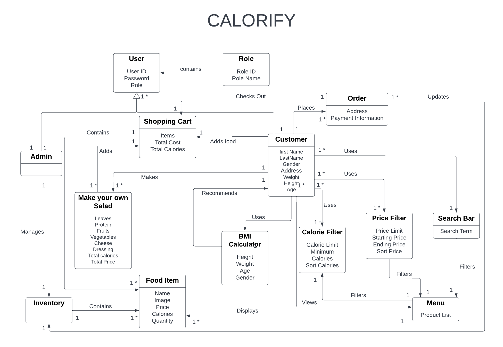

# Calorify Design Documentation

## Team Information

* Team name: Calorify
* Team members
  * Sohan Saimbhi
  * Hritish Mahajan
  * Christin Alex
  * Syed Basit Hussain
  * Eslam Tarrum

## Executive Summary

Calorify is an e-commerce store which is dedicated to allowing the customers to choose and purchase healthy food products in order to cater to their calorie intake requirements. We want to provide a platform on which customers can, easily and safely, browse and purchase various healthy food products including salads, wraps, dips and our signature dishes. It is completely user-input based so that we can meet the needs of our customer and help them acheive their diet goals.

### Purpose

Our purpose is to allow our customers to purchase high quality healthy food products to satisfy their daily calorie requirements with a considerable amount of freedom towards customization. The inventory manager or the owner of the store, their functionality includes that they can view, add, update, and delete products from the menu listing.

### Glossary and Acronyms

| Term | Definition |
|------|------------|
| SPA | Single Page Application |
| User | Any person who accesses our calorify website |
| Buyer | A person who register a new account and logs in with the intention to purchase the food products |
| Admin | A person who logs in with the admin username and upkeeps the inventory of calorify |
| Shopping cart | A collection of food products chosen by the buyer for them to purchase at the checkout |
| Product | The food products which are sold in the estore |
| MVP | Minimum Viable Product |
| 10% feature | An additional feature implemented on top of the MVP |
| DAO | Data Access Object, within the persistence tier |
| HTTP | HyperText Transfer Protocol, a network protocol for specifications on how data should be transferred |
| CSS | Cascading Style Spreadsheets that describe how HTML elements are to be displayed on screen and deals with the styling of the website |
| UI | View section of the project to be shown to the user |
| API | Application Programming Interface, connection interface between computers or computer programs. It helps the client application communicate with the server application. |

## Requirements

Calorify supports user creation via signup and will display an error message to the user if the username provided is already a logged user. 
Calorify supports userLogin via username, with “admin” reserved for the inventory manager, to control traffic into two main pages: the customer browse page and the admin browse page.
2) Non-functional requirements:
- The website must be secure and protect the customer's personal information
- The website must be responsive and work on all devices
- The website must be easy to use and navigate
- The website must have a modern and sleek design

User Features: Users can see the list of products in the inventory. This inventory can be filtered by max price where the list of products shown will update on the user’s screen to only display products beneath the user-defined max price, calories. The inventory shown can also be updated live via a product search. Only products containing the user-defined search term will be shown on the screen. The user can click on any product shown to be redirected to each product’s detail page. From there the user can select their product, and eventually adding the product to their shopping cart. The user can continue to shop, add to their shopping cart, and remove from the shopping cart. From the shopping cart, the user can see the list of products they have in their shopping cart and can click on the checkout button to finalize their purchase. At all times, the user can navigate from Login, Browse, and ShoppingCart pages. 

Admin Features: The admin can see the list of products in the inventory, search for specific products, and add new product listings on their browse page. When the admin clicks on a specific product listing, they are directed to the product’s detail page where they can update the price and quantity, calories, image.

### Definition of MVP

The minimum viable product includes: 

Login and logout functionality, where an inventory manager can log in as "admin" and no passwords are required

Customer functionality, including searching for products, adding products to their shopping cart, and checking out Inventory management, which allows inventory managers to add, remove, and update products in the inventory Data persistence, so that the inventory, users, and user shopping carts are saved.

10% feature - An additional feature implemented on top of the MVP.

### MVP Features

#### Epics

##### Product Lists

List Products on Customer Product Page
Product Details

##### Inventory Management

Add to Inventory
List Inventory
Delete from Inventory
Edit inventory item

##### Shopping Cart

Display Cart
Add to Cart
Remove from Cart
Change Quantity
Confirm Cart
Cart Persistence

##### Login

Logout
Login as User
Login as E-Store Admin

##### Product API

Create New Product
Get a single product
Get Entire Inventory
Search Product
Update Product
Delete a Single Product

##### User API

Create a New User
Get a Single User
Update User
Delete User
Get All Users

##### Registration Page

Entering and Creating User
Enter Personal Details

##### User Profile

View User Profile
Edit User Profile

##### Role API

Create a New Role
Get All Roles
Delete Role

##### Spring Security- Login API and User Roles

Login API
Admin Registration Roles
User Registration Roles
Unregistered User Roles

##### Product Search Component

Search Food Items by Name
Search Food Items by Price
Search Food Items by Caloric Range

##### Sorting and Filters

Sort by Calories
Sort by Price

##### Customer Checkout

Checkout from Shopping Cart
List Shopping Cart Contents on Checkout Page
Purchase Options
Direct Checkout from Product Details

##### Make Your Own Salad

Add Ingredients
Remove Ingredients
Calorie Adder

### Roadmap of Enhancements

#### Caloric Intake Progress & Statistics

#### Diet Plan

#### Customer Processes

#### Order Management

#### Health Tips

#### Rewards

## Application Domain

There are two main entities in the domain model: the user and the product. The user can be a customer or an admin. The product is the food item that the user can purchase. The user can add products to their shopping cart, and the shopping cart can be persisted. The user can also search for products by name, price, and calories. The admin can add, remove, and update products in the inventory.

## Architecture and Design

Our application consists of three main components: the model, the controller and the persistence. The Angular framework is used to create the Estore-UI, which is contained within the view component and is made up of HTML, CSS, and TypeScript. The Estore-API receives HTTP requests from the view and responds with HTTP answers. The view model and the model are both parts of the Estore-API component. The view model houses the controller and services, which are both built in Java and make use of the Spring framework. Our persistence and application models, which are both written in Java, are included in the model. The Estore-API uses I/O to communicate with the storage. JSON files constitute the storage.

### Summary

The following Tiers/Layers model shows a high-level view of the webapp's architecture.

The e-store web application, is built using the Model–View–ViewModel (MVVM) architecture pattern.

The Model stores the application data objects including any functionality to provide persistance.

The View is the client-side SPA built with Angular utilizing HTML, CSS and TypeScript. The ViewModel provides RESTful APIs to the client (View) as well as any logic required to manipulate the data objects from the Model.

Both the ViewModel and Model are built using Java and Spring Framework. Details of the components within these tiers are supplied below.

### Overview of User Interface

When a user first launches the application, they see the login page, where they are given the option to either login or to sign up. From the sign up option, the user is taken to a page which prompts for a username. The user can then either select to create their account, or to cancel. Cancel takes the user back to the login page. Create account will create a new account for the user with the given username, log them in, and bring them to the browse page unless there is already an account with that username, in which case, the user will receive a message alerting them of this issue. Now, when the user is on the login page, enters an existing username that is not “admin,” and selects the login option, they are logged into the application and are taken to the browse page, where they see the inventory of products below a menu bar, with the options of login, browse, and shopping cart, along with a search bar where they can search for products whose names contain the entered string. If they select a product from this browse page, they are taken to a page containing details of the product, which also gives them the option to add the item to their cart, and to personalize the item (i.e. add an engraving message, choose their varnish). If they select the shopping cart option from the menu, they are taken to a page which displays the items currently in their shopping cart. When the user is on the login page and enters the username “admin,” they are brought to the admin-browse page where they can view and add products to, or remove products from, the inventory. When they select a specific product, they are brought to the admin-product-detail page, where they can update the product’s information.

### View Tier

> _Provide a summary of the View Tier UI of your architecture.
> Describe the types of components in the tier and describe their
> responsibilities.  This should be a narrative description, i.e. it has
> a flow or "story line" that the reader can follow._

> _You must also provide sequence diagrams as is relevant to a particular aspects
> of the design that you are describing.  For example, in e-store you might create a
> sequence diagram of a customer searching for an item and adding to their cart.
> Be sure to include an relevant HTTP reuqests from the client-side to the server-side
> to help illustrate the end-to-end flow._

### ViewModel Tier

> _Provide a summary of this tier of your architecture. This
> section will follow the same instructions that are given for the View
> Tier above._
> _At appropriate places as part of this narrative provide one or more
> static models (UML class diagrams) with some details such as critical attributes and methods._

### Model Tier

> _Provide a summary of this tier of your architecture. This
> section will follow the same instructions that are given for the View
> Tier above._
> _At appropriate places as part of this narrative provide one or more
> static models (UML class diagrams) with some details such as critical attributes and methods._

### Static Code Analysis/Design Improvements

> _Discuss design improvements that you would make if the project were
> to continue. These improvement should be based on your direct
> analysis of where there are problems in the code base which could be
> addressed with design changes, and describe those suggested design
> improvements._
> _With the results from the Static Code Analysis exercise,
> discuss the resulting issues/metrics measurements along with your analysis
> and recommendations for further improvements. Where relevant, include
> screenshots from the tool and/or corresponding source code that was flagged._

## Testing

> _This section will provide information about the testing performed
> and the results of the testing._

### Acceptance Testing

> _Report on the number of user stories that have passed all their
> acceptance criteria tests, the number that have some acceptance
> criteria tests failing, and the number of user stories that
> have not had any testing yet. Highlight the issues found during
> acceptance testing and if there are any concerns._

## Unit Testing and Code Coverage

Our unit testing strategy is to make sure that our tests are thorough, independent and readable. Thorough meaning that we are performing at a high code coverage - at least 90% overall. Independent meaning that we are testing one thing at a time. For example, we’ve decided that a unit is a class. We are testing each and every component of a class - its state and functions as well as those functions method arguments.

### Coverage: Controller Tier

 
 

Analysis

For our Inventory Controller file, we have 95% coverage which is really good already. searchProducts is 87% instructions covered. All the other are 100% instructions covered. The ideal coverage for controller file should 90% and above so our controller satisfies the requirement
Most of the missed instructions and branches are in searchProduct().

As such, for proper coverage, we could write tests that cover a test that tests product.length in terms of whether, if product.length == 0, assert that the result is NOT_FOUND. We should also cover the code branches of when name != null or name =null in our tests. Along with this we can write tests to cover products != null or products = null

### Coverage: Model Tier

 
 

Analysis
 
 It is very well tested file and all code is covered as we can above we achieved 100% code coverage

### Coverage: Persistence Tier

 
 

Analysis
 We are only 2% short of the ideal requirement of 90%. We would have to test our getProduct array, createproduct elements in our InventoryFileDAO more thoroughly in order to achieve a decent coverage. As we can see, all the other elements have been covered 100%.

We could add tests that take into account when containsCalories == null and containsCalories != null. We could add tests that account for if containsText == null and getCalories<=containsCalories, expect the product to be added to productArrayList. We could write the tests that are alternative to this. A final set of testcases could expect that product was added if containsCalories and containsText != null along with products name matches the text searched. One alternative to this would be expect product not to be added if these if conditions are not met.

## Object Oriented Principle Adherence

### Single Responsibility

Single Responsibility is very essential for our project. This principle is made use of in this project. Single Responsibility is one of the most important principles across all the principles. It simply means that each class defined must have only one single responsibility. It makes the application easier to maintain and also easier to understand. It is also done to ensure that in the future, if any changes are made to the code, it does not affect every class or dependent since each key functionality has its own separate class. Each class in the project has a very well-defined responsibility it must adhere to. The methods and attributes inside the class also contribute to the same. For example, the Product Class, holds information regarding every aspect of the product pertaining to that itself and has only that responsibility. It has many advantages, but the notable ones are that it is easier to understand the scope of a change in a class. It is easier to manage concurrent modifications or changes made.

Its main goal is the separation of responsibilities, which causes separate concerns to go into separate classes and also helps with testing the application, since it’s simpler to test each short individual class. The project follows this object-oriented design principle. For example , the InventoryController Class had the sole purpose of handling API requests related to product inventory. If any particular request arrives, it has to communicate with that particular method and then provide the response. It handles API requests and returns back HTTP responses. This class has no apparent relationship or even is not concerned with the management of the Products data, or even the persistence aspect which is the storage mechanism for our project. The persistence directory has the InventoryDAO and the Inventory File DAO class, which has the responsibility of storing data. The Inventory Controller Class delegates this management and storage responsibility to the InventoryDAO Class. Hence, the InventoryController class of our project is an apt example for single responsibility. Clustering every mechanism into this class would limit the reusability of the class, making it difficult to unit test the application. Solidifying the purpose of each class, so that each class has one responsibility leads to better adherence with this principle. Unnecessary coupling must also be avoided since single responsibility could lead to that.

### Dependency Inversion

The Dependency Inversion Principle provides and allows room for looser coupling between dependent entities. Martin defines this principle as “High Level Modules should not depend on low-level modules. Both should depend on abstractions.". This project utilizes this principle. Dependency Inversion Principle reduces coupling between different pieces of code. It basically seeks to help with code reusability. Also, this principle is critical for doing unit tests since we can inject objects into the constructor. In this the low-level module has no responsibility to instantiate a dependent class. The high-level module injects the dependent elements and the low-level is dependent on the high-level’s abstraction and not its implementation. Dependency Injection can be defined as a principle that provides looser coupling between dependent entities. In other words, higher level classes should not depend on low-level classes. Both should depend on some layer of abstraction to communicate. Calorify's backend API is built on Spring Boot which provides what is necessary for successfully implementing dependency injection through the use of a configuration file. Dependency injection is implemented between InventoryController, and InventoryFileDAO through the interface InventoryDAO. Spring, via configuration, creates an InventoryFileDAO object.
For example, in this case the framework creates an InventoryFileDAO object. It then, injects this InventoryFileDAO object into the Inventory Controller when it’s called or instantiated. Our controller class, Inventory Controller only is told to deal with the abstraction which is the higher level InventoryDAO. This enhances the reusability of the code in addition to provide the ease of independently testing the Inventory Controller and the InventoryFileDAO class. As discussed in the above example, the InventoryController Class only deals with the higher level InventoryDAO abstraction. The benefit of this is that the lower-level implementation of storing and accessing/manipulating data can be updated at any point in time without having an effect on the InventoryController class’s responsibility. To illustrate this, the current underlying storing mechanism is a file using json objects representing an array of products. So, we know, that as long as the data access object is adhering to all the principles, our InventoryController does not need to change at all. In fact, even in angular the services aspect is a huge supporter of dependency injection. Since the project follows MVC (Model-View-Controller) Architecture, it already exclusively is designed to support the Object-Oriented Programming Design Principles.

### Information Expert

Information Expert is a design pattern that states “Assign responsibility to the class that has the information needed to fulfill the responsibility.”
According to this principle, responsibilities are assigned in the form of methods which are fields to classes. All behaviors that directly work with a class's attributes should be implemented in the class itself. Any operations that the client would perform using the attribute data or class methods should also be considered for implementation. The client shouldn’t be doing any “heavy-lifting”, all methods should be simplified for their use.

### Low Coupling

Low coupling is the principle which aims to reduce the impact of any change in the system. If a change needs to be made somewhere, there shouldn’t be any unnecessary coupling such that you may have to make many changes in different classes.
For example, To make the Product class to work, an InventoryController class, an InventoryDAO interface, and the InventoryFileDAO class which implements it, are required, which are all connected together. There should be minimal number of connections for any class.
