# Calorify Design Documentation

## Team Information

* Team name: Calorify
* Team members
  * Sohan Saimbhi
  * Hritish Mahajan
  * Christin Alex
  * Syed Basit Hussain
  * Eslam Tarrum

## Executive Summary

Calorify is an e-commerce store which is dedicated to allowing the customers to choose and purchase healthy food products in order to cater to their calorie intake requirements. We want to provide a platform on which customers can, easily and safely, browse and purchase various healthy food products including salads, wraps, dips and our signature dishes. It is completely user-input based so that we can meet the needs of our customer and help them acheive their diet goals.

### Purpose

Our purpose is to allow our customers to purchase high quality healthy food products to satisfy their daily calorie requirements with a considerable amount of freedom towards customization. The inventory manager or the owner of the store, their functionality includes that they can view, add, update, and delete products from the menu listing.

### Glossary and Acronyms

| Term | Definition |
|------|------------|
| SPA | Single Page Application |
| User | Any person who accesses our calorify website |
| Buyer | A person who register a new account and logs in with the intention to purchase the food products |
| Admin | A person who logs in with the admin username and upkeeps the inventory of calorify |
| Shopping cart | A collection of food products chosen by the buyer for them to purchase at the checkout |
| Product | The food products which are sold in the estore |
| MVP | Minimum Viable Product |
| 10% feature | An additional feature implemented on top of the MVP |
| DAO | Data Access Object, within the persistence tier |
| HTTP | HyperText Transfer Protocol, a network protocol for specifications on how data should be transferred |
| CSS | Cascading Style Spreadsheets that describe how HTML elements are to be displayed on screen and deals with the styling of the website |
| UI | View section of the project to be shown to the user |
| API | Application Programming Interface, connection interface between computers or computer programs. It helps the client application communicate with the server application. |

## Requirements

The store will be based on Spring Boot as a backend and Angular JS as front end working together to provide the functionality of the Calorify store.
We have considered the following functional and non-functional requirements:

1) Functional requirements:

* The website must allow the customer to create an account and login
* The website must not allow identical users to be registered
* The website must allow the customer to view the list of products and their nutritional information
* The application will support adding new products to the inventory, with only the administrator having access to this function.
* The website must allow admin to create, update, read and delete products from inventory
* The website must only allow specific pages to be viewed by admin
* The website must not allow specific pages to be viewed by customer
* The website must not allow specific pages to be viewed by unregistered user
* The website must allow the customer to filter products by price
* The website must allow customers to find products containing the user search term in their name
* The application will support sorting products by price, name, and calories.
* The website must allow customer to see details of a product of interest
* The website must allow the customer to read, add, remove, update and delete products from their cart
* The website must allow the customer to checkout and purchase the products in their cart
* The website must allow the customer to view their purchase history
* The website must allow the customer to provide feedback on the products

2) Non-functional requirements:

* The website must be secure and protect the customer's personal information
* The website must be responsive and work on all devices
* The website must be easy to use and navigate
* The website must have a modern and sleek design

### Definition of MVP

The minimum viable product includes

Login and logout functionality, where an inventory manager can log in as "admin" and no passwords are required

Customer functionality, including searching for products, adding products to their shopping cart, and checking out Inventory management, which allows inventory managers to add, remove, and update products in the inventory Data persistence, so that the inventory, users, and user shopping carts are saved.

10% feature - An additional feature implemented on top of the MVP.

### MVP Features

#### Epics

##### Product Lists

List Products on Customer Product Page
Product Details

##### Inventory Management

Add to Inventory
List Inventory
Delete from Inventory
Edit inventory item

##### Shopping Cart

Display Cart
Add to Cart
Remove from Cart
Change Quantity
Confirm Cart
Cart Persistence

##### Login

Logout
Login as User
Login as E-Store Admin

##### Product API

Create New Product
Get a single product
Get Entire Inventory
Search Product
Update Product
Delete a Single Product

##### User API

Create a New User
Get a Single User
Update User
Delete User
Get All Users

##### Registration Page

Entering and Creating User
Enter Personal Details

##### User Profile

View User Profile
Edit User Profile

##### Role API

Create a New Role
Get All Roles
Delete Role

##### Spring Security- Login API and User Roles

Login API
Admin Registration Roles
User Registration Roles
Unregistered User Roles

##### Product Search Component

Search Food Items by Name
Search Food Items by Price
Search Food Items by Caloric Range

##### Sorting and Filters

Sort by Calories
Sort by Price

##### Customer Checkout

Checkout from Shopping Cart
List Shopping Cart Contents on Checkout Page
Purchase Options
Direct Checkout from Product Details

##### Make Your Own Salad

Add Ingredients
Remove Ingredients
Calorie Adder

### Roadmap of Enhancements

#### Caloric Intake Progress & Statistics

#### Diet Plan

#### Customer Processes

#### Order Management

#### Health Tips

#### Rewards

## Application Domain

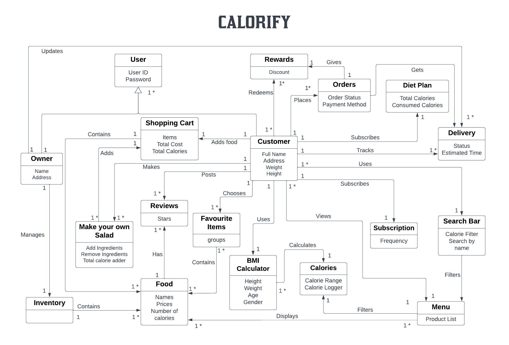

There is a parent entity which represents the user, is then extended into two based on privileges of the role: 1) admin/owner 2) customer. Another crucial entity is the product/food that is being sold for purchase by a customer. The products being sold are kept inside inventory. The admin is able to modify the contents of this inventory. A customer has access to the menu which displays all the products present in the inventory. The admin is the only one allowed to add, remove, and update products in the inventory. The customer can also search for products by name, price, and calories. If the customer wants to filter for a specific product or type of product, they use the Search bar. They can also use search filters to specify and narrow down the price or calories they want to intake. They can also sort the menu by price or calories.

The customer can add products from inventory to their shopping cart, which can be described as an attribute of User and the shopping cart is persistent across login sessions. The customer can checkout from shopping cart to place an order. For checking out, the customer has to enter an address and card details. The items are then subtracted from inventory. The customer can use ingredients in the inventory to make their own salad which will be a custom product created by the user that will be placed in the shopping cart and can be purchased in checkout. Finally the customers personal details can be usd to calculate BMI and the recommended calories. This can be used by the user to filter products based their suggested calorie intake.

## Architecture and Design

The Estore-UI is the graphical user interface front end for our application. It is made up of HTML, CSS, and TypeScript code and uses the Angular framework. The Estore-UI communicates with the Estore-API to fetch data and to send data back to the backend for processing.

The Estore-API is the back end for our application. It is made up of Java code and uses the Spring framework. The Estore-API receives HTTP requests from the Estore-UI and responds with HTTP answers. The Estore-API uses I/O to communicate with the storage for read and write. JSON files constitute the storage and format of requests and response bodies

Our application consists of three main components: the model, the controller and the persistence.

The model is the part of the application representing the data layer of our application with classes. The model is the format in which information may be saved in a persistent file. For example, a User that stores information about users in the form of Object

The controller is responsible for handling user requests and responses. It is what will call the Data Access Object when appropriate to retrieve and add information and perform logic on them. The controller is written in Java and makes use of the Spring framework.

The services are responsible for business logic.

### Summary

The following Tiers/Layers model shows a high-level view of the webapp's architecture.

The e-store web application, is built using the Model–View–ViewModel (MVVM) architecture pattern.

The Model stores the application data objects including any functionality to provide persistance.

The View is the client-side SPA built with Angular utilizing HTML, CSS and TypeScript. The ViewModel provides RESTful APIs to the client (View) as well as any logic required to manipulate the data objects from the Model. 

The Controller is written in Java and provides the logic for the application as well as the communication layer between the ViewModel and the Model.

Both the ViewModel and Model are built using Java and Spring Framework. Details of the components within these tiers are supplied below.
### Spring Security Architecture

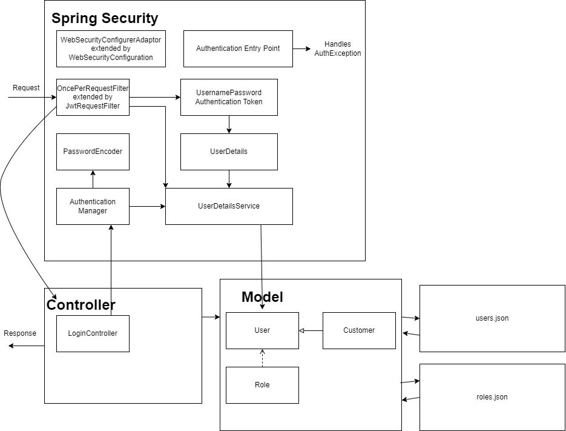

### Overview of User Interface

When a user first launches the application, they see the login page, where they are given the option to either login or to sign up. From the sign up option, the user is taken to a page which prompts for a username. The user can then either select to create their account, or to cancel. Cancel takes the user back to the login page. Create account will create a new account for the user with the given username, log them in, and bring them to the browse page unless there is already an account with that username, in which case, the user will receive a message alerting them of this issue. Now, when the user is on the login page, enters an existing username that is not “admin,” and selects the login option, they are logged into the application and are taken to the browse page, where they see the inventory of products below a menu bar, with the options of login, browse, and shopping cart, along with a search bar where they can search for products whose names contain the entered string. If they select a product from this browse page, they are taken to a page containing details of the product, which also gives them the option to add the item to their cart, and to personalize the item (i.e. add an engraving message, choose their varnish). If they select the shopping cart option from the menu, they are taken to a page which displays the items currently in their shopping cart. When the user is on the login page and enters the username “admin,” they are brought to the admin-browse page where they can view and add products to, or remove products from, the inventory. When they select a specific product, they are brought to the admin-product-detail page, where they can update the product’s information.

### View Tier

The view tier is the user interface of the application. The View is the client-side SPA built with Angular utilizing HTML, CSS and TypeScript. It is responsible for displaying data to the user and for gathering input from the user. The view tier consists of two types of components: UI components and presentation components.
The UI components are responsible for generating the HTML that is sent to the client. They use the presentation components to get the data that they need to display. The presentation components are responsible for getting the data from the business tier and for formatting it for the UI components.
The sequence diagram below shows a customer searching for an item and adding it to their cart. The customer starts by entering a search term into the search box. This sends an HTTP GET request to the server. The server then calls the business tier to get a list of items that match the search term. The business tier returns a list of items to the server. The server then calls the presentation tier to format the data for the UI components. The presentation tier returns the formatted data to the server. The server then calls the UI components to generate the HTML for the search results page. The UI components return the HTML to the server. The server then sends the HTML to the client. The client displays the HTML to the user.

### ViewModel Tier

The view model is the part of the application the user interacts with. The ViewModel provides RESTful APIs to the client (View) as well as any logic required to manipulate the data objects from the Model. It is made up of HTML, CSS, and TypeScript code and uses the Angular framework. The view model communicates with the controller to fetch data and to send data back to the backend for processing. View components are implemented as EJS templates which are rendered and served by the server. When a user navigates to the home page, the server will render and serve the home page template. The home page template contains static content as well as dynamic content that is populated by querying the database. For example, the home page template might contain a list of the most popular items on the site. This list is generated by querying the database and then passed to the home page template which renders the list in HTML.

The view tier of the e-store has the following components:
* Home Page
* Product Listing Page
* Product Details Page
* Shopping Cart Page
* Checkout Page
* Registration and Login Page

### Model Tier
          

The model tier is responsible for storing the data for the application. The model tier consists of three types of components: data objects, data access objects, and business objects. The data objects are responsible for storing the data for the application. The data access objects are responsible for getting the data from the storage layer and for saving the data to the storage layer. The business objects are responsible for performing the business logic for the application. For example, a customer adding an item to their cart. The customer clicks on the add to cart button for an item. This sends an HTTP POST request to the server. The server then calls the business tier to add the item to the customer’s cart. The business tier calls the data access tier to get the data for the item from the storage layer. The data access tier returns the data for the item to the business tier. The business tier then adds the item to the customer’s cart. The business tier calls the data access tier to save the customer’s cart to the storage layer. The data access tier saves the customer’s cart to the storage layer.

> _Provide a summary of this tier of your architecture. This
> section will follow the same instructions that are given for the View
> Tier above._
> _At appropriate places as part of this narrative provide one or more
> static models (UML class diagrams) with some details such as critical attributes and methods._

### Sequence Diagrams

#### Create Product

#### Add to Cart

### Static Code Analysis/Design Improvements

### Static Code Analyis Issues - API

For the API, we had 194 issues shown with about an hour or two of estimated effort required to fix them. Almost all these issues are minor and repetitive and do not affect any functionality of our estore.

It can be challenging to update a static field correctly from a non-static method, and if there are numerous threads or instances of the class in use, errors are likely to result. Static fields should ideally only be updated by synchronized static methods. We have not made the methods static. We will have to include the static modifier in the method definition. This is an easy fix by just adding the static modifier to the method. We have about 6 instances of this and were marked as Critical.

Although JUnit5 test classes can have any visibility other than private, using the default package visibility is better because it makes the code easier to read. We have specified the public modifier in the JUnit Test Methods. However, this is redundant do not need to specify the public modifier for test methods. This is an easy fix by just removing the public modifier from the method. We have about 108 instances of this.

To make generics code less verbose, Java included the diamond operator (<>). For example, we can now simplify the constructor declaration with <>, and the compiler will infer the type, rather than having to state a List's type in both its declaration and its constructor. We have specified the Generic Type inside diamond operator in the return statement. However, this is redundant since we already defined it in the function definition. This is an easy fix by just removing the Generic Type from the diamond operator. We have about 24 instances of this.

### Static Code Analyis Issues - UI

For the UI, we had 23 issues shown with about an hour of estimated effort required to fix them. Almost all these issues are minor and do not affect any functionality of our estore.

We had 4 issues of unused imports, which were probably left there during us testing out different methods to implement UI components. The fix is simple, we just need to delete the lines that have these import statements.

We have 5 issues of empty constructors or methods, namely the ngOnInit and constructor methods in some components. This is another simple fix, where we just need to delete the lines that have these empty methods.

## Testing

### Acceptance Testing

A total of 46 stories were tested and all of them are PASSING.
None of the tested Stories are failing. 
We have a minor exception handling bug that will be fixed ASAP.

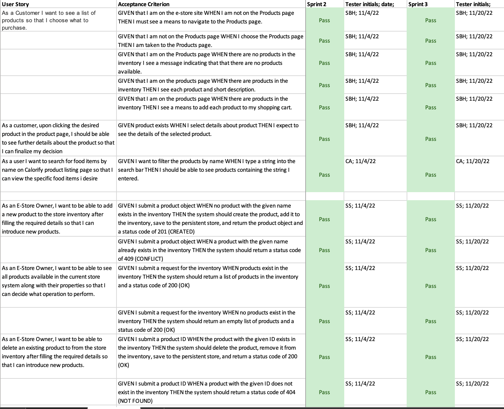

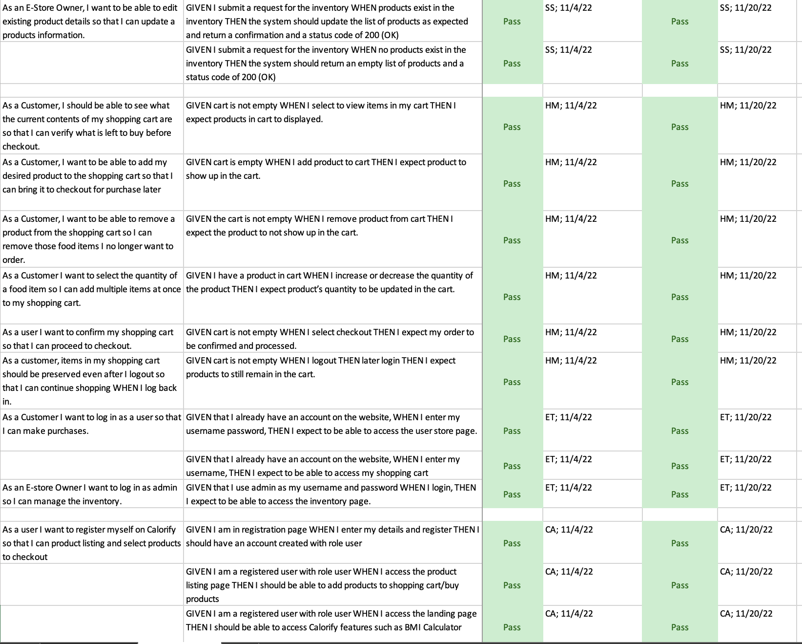

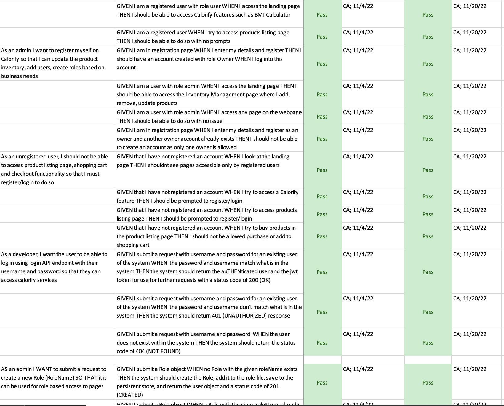

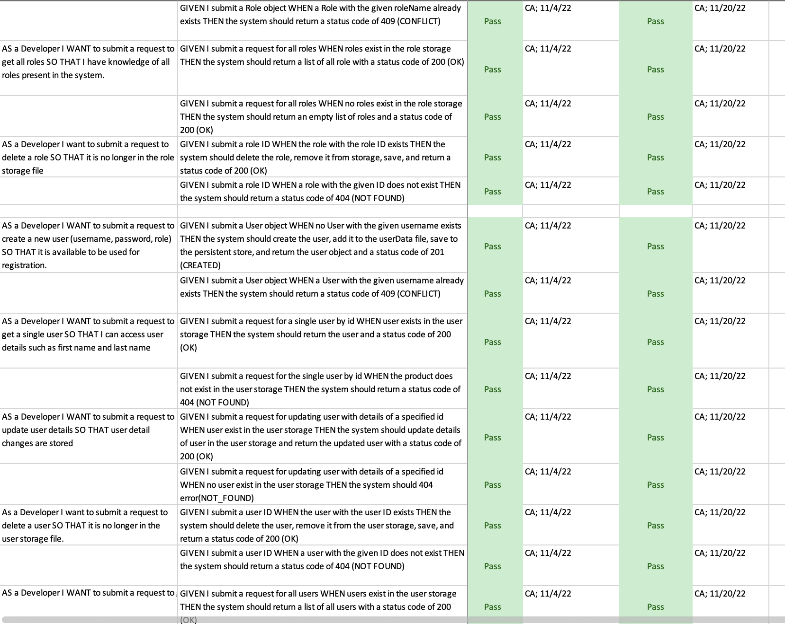

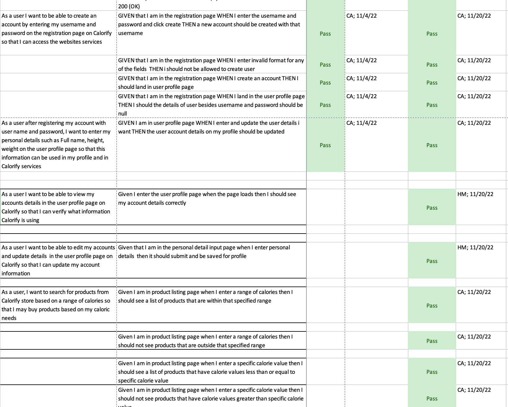

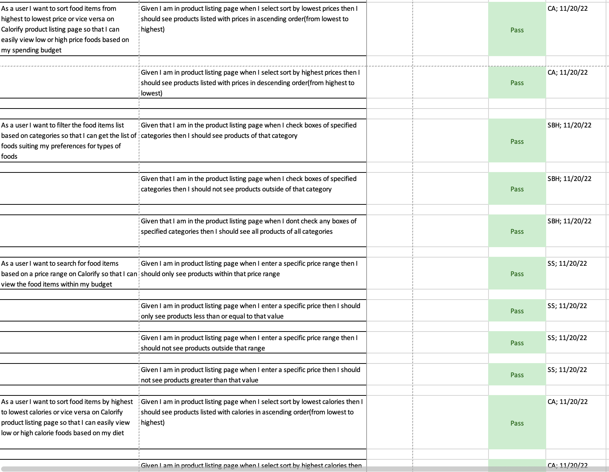

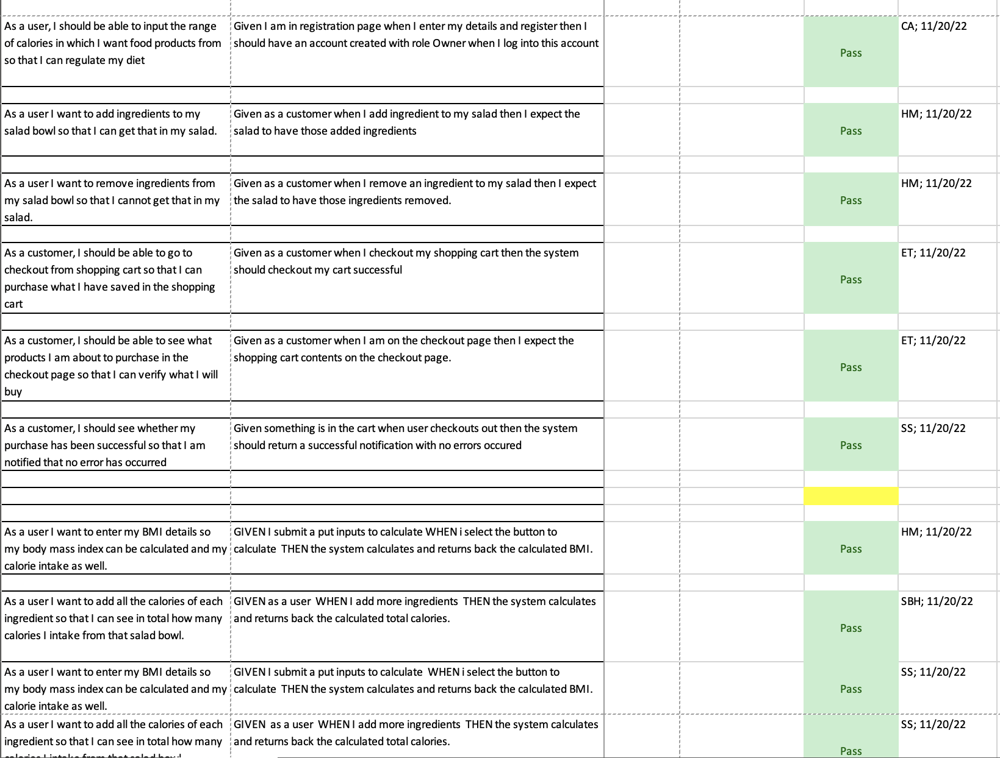

## Unit Testing and Code Coverage

Our unit testing strategy is to make sure that our tests are thorough, independent and readable. Thorough meaning that we are performing at a high code coverage - at least 90% overall. Independent meaning that we are testing one thing at a time. For example, we’ve decided that a unit is a class. We are testing each and every component of a class - its state and functions as well as those functions method arguments.

### Coverage: Controller Tier

 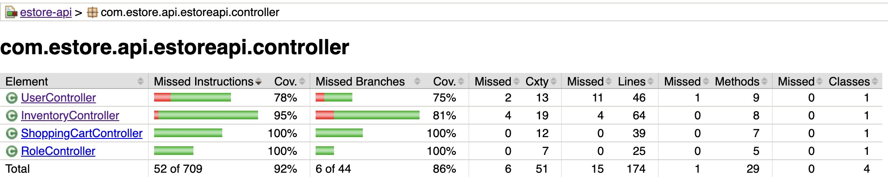
 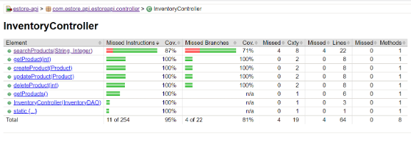

Analysis

For our Inventory Controller file, we have 95% coverage which is really good already. searchProducts is 87% instructions covered. All the other are 100% instructions covered. The ideal coverage for controller file should 90% and above so our controller satisfies the requirement
Most of the missed instructions and branches are in searchProduct().

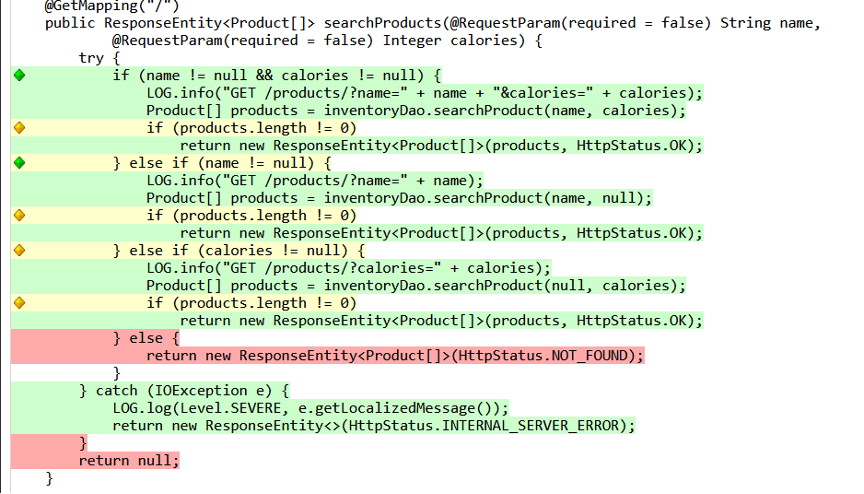

As such, for proper coverage, we could write tests that cover a test that tests product.length in terms of whether, if product.length == 0, assert that the result is NOT_FOUND. We should also cover the code branches of when name != null or name =null in our tests. Along with this we can write tests to cover products != null or products = null

### Coverage: Model Tier

 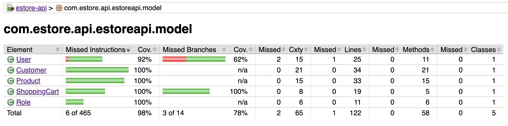
 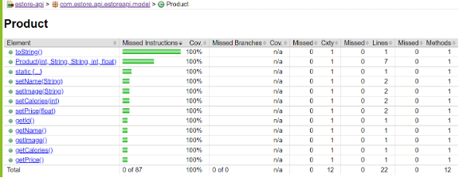

Analysis

 It is very well tested file and all code is covered as we can above we achieved 100% code coverage

### Coverage: Persistence Tier

 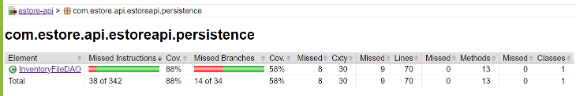
 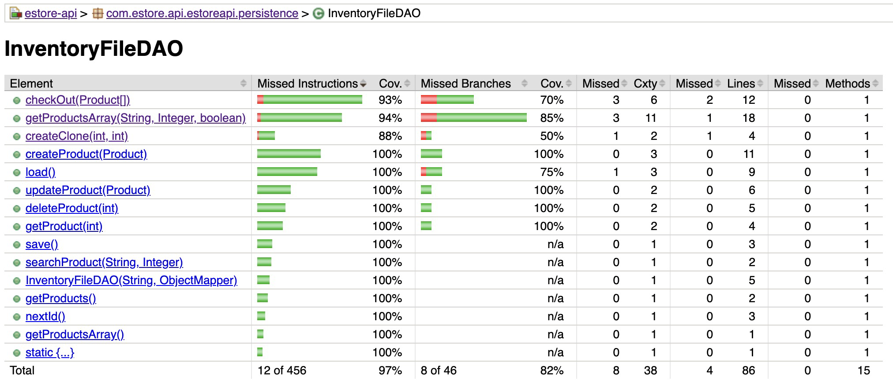

Analysis
 We are only 2% short of the ideal requirement of 90%. We would have to test our getProduct array, createproduct elements in our InventoryFileDAO more thoroughly in order to achieve a decent coverage. As we can see, all the other elements have been covered 100%.

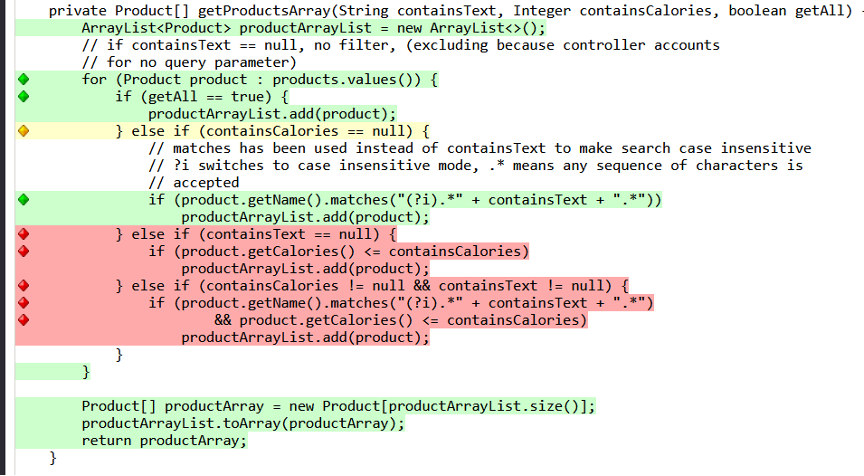

We could add tests that take into account when containsCalories == null and containsCalories != null. We could add tests that account for if containsText == null and getCalories<=containsCalories, expect the product to be added to productArrayList. We could write the tests that are alternative to this. A final set of testcases could expect that product was added if containsCalories and containsText != null along with products name matches the text searched. One alternative to this would be expect product not to be added if these if conditions are not met.

### Coverage: Poorly Tested Component

This is our analysis of a poorly-tested component.

Analysis
In RoleFileDAO element, it only covers 85% code and covers 71% branches and createRole element, it only covers 56% code. We will work on this poorly tested component as soon as possible. 

## Object Oriented Principle Adherence

### Single Responsibility

Single Responsibility is very essential for our project. This principle is made use of in this project. Single Responsibility is one of the most important principles across all the principles. It simply means that each class defined must have only one single responsibility. It makes the application easier to maintain and also easier to understand. It is also done to ensure that in the future, if any changes are made to the code, it does not affect every class or dependent since each key functionality has its own separate class. Each class in the project has a very well-defined responsibility it must adhere to. The methods and attributes inside the class also contribute to the same. For example, the Product Class, holds information regarding every aspect of the product pertaining to that itself and has only that responsibility. It has many advantages, but the notable ones are that it is easier to understand the scope of a change in a class. It is easier to manage concurrent modifications or changes made.

Its main goal is the separation of responsibilities, which causes separate concerns to go into separate classes and also helps with testing the application, since it’s simpler to test each short individual class. The project follows this object-oriented design principle. For example , the InventoryController Class had the sole purpose of handling API requests related to product inventory. If any particular request arrives, it has to communicate with that particular method and then provide the response. It handles API requests and returns back HTTP responses. This class has no apparent relationship or even is not concerned with the management of the Products data, or even the persistence aspect which is the storage mechanism for our project. The persistence directory has the InventoryDAO and the Inventory File DAO class, which has the responsibility of storing data. The Inventory Controller Class delegates this management and storage responsibility to the InventoryDAO Class. Hence, the InventoryController class of our project is an apt example for single responsibility. Clustering every mechanism into this class would limit the reusability of the class, making it difficult to unit test the application. Solidifying the purpose of each class, so that each class has one responsibility leads to better adherence with this principle. Unnecessary coupling must also be avoided since single responsibility could lead to that.

### Dependency Inversion

The Dependency Inversion Principle provides and allows room for looser coupling between dependent entities. Martin defines this principle as “High Level Modules should not depend on low-level modules. Both should depend on abstractions.". This project utilizes this principle. Dependency Inversion Principle reduces coupling between different pieces of code. It basically seeks to help with code reusability. Also, this principle is critical for doing unit tests since we can inject objects into the constructor. In this the low-level module has no responsibility to instantiate a dependent class. The high-level module injects the dependent elements and the low-level is dependent on the high-level’s abstraction and not its implementation. Dependency Injection can be defined as a principle that provides looser coupling between dependent entities. In other words, higher level classes should not depend on low-level classes. Both should depend on some layer of abstraction to communicate. Calorify's backend API is built on Spring Boot which provides what is necessary for successfully implementing dependency injection through the use of a configuration file. Dependency injection is implemented between InventoryController, and InventoryFileDAO through the interface InventoryDAO. Spring, via configuration, creates an InventoryFileDAO object.
For example, in this case the framework creates an InventoryFileDAO object. It then, injects this InventoryFileDAO object into the Inventory Controller when it’s called or instantiated. Our controller class, Inventory Controller only is told to deal with the abstraction which is the higher level InventoryDAO. This enhances the reusability of the code in addition to provide the ease of independently testing the Inventory Controller and the InventoryFileDAO class. As discussed in the above example, the InventoryController Class only deals with the higher level InventoryDAO abstraction. The benefit of this is that the lower-level implementation of storing and accessing/manipulating data can be updated at any point in time without having an effect on the InventoryController class’s responsibility. To illustrate this, the current underlying storing mechanism is a file using json objects representing an array of products. So, we know, that as long as the data access object is adhering to all the principles, our InventoryController does not need to change at all. In fact, even in angular the services aspect is a huge supporter of dependency injection. Since the project follows MVC (Model-View-Controller) Architecture, it already exclusively is designed to support the Object-Oriented Programming Design Principles.

### Information Expert

Information Expert is a design pattern that states “Assign responsibility to the class that has the information needed to fulfill the responsibility.”
According to this principle, responsibilities are assigned in the form of methods which are fields to classes. All behaviors that directly work with a class's attributes should be implemented in the class itself. Any operations that the client would perform using the attribute data or class methods should also be considered for implementation. The client shouldn’t be doing any “heavy-lifting”, all methods should be simplified for their use. For example, let’s say we have a class called “Animal”, and this class has a field called “name”. The “name” field is used to store the name of the animal. We would want to implement a method in the Animal class to set the name of the animal, and another method to get the name of the animal. This way, the client doesn’t have to worry about how the name is stored, or how to set it. They can simply call the methods that are provided.

### Low Coupling

Low coupling is the principle which aims to reduce the impact of any change in the system. If a change needs to be made somewhere, there shouldn’t be any unnecessary coupling such that you may have to make many changes in different classes.
For example, To make the Product class to work, an InventoryController class, an InventoryDAO interface, and the InventoryFileDAO class which implements it, are required, which are all connected together. There should be minimal number of connections for any class.

### High Cohesion

High cohesion is the principle which aims to move closely related items together. The classes which are closely related to each other should be placed together. For example, the Product class and the Inventory class can be placed together in the same package, because they are closely related to each other.
